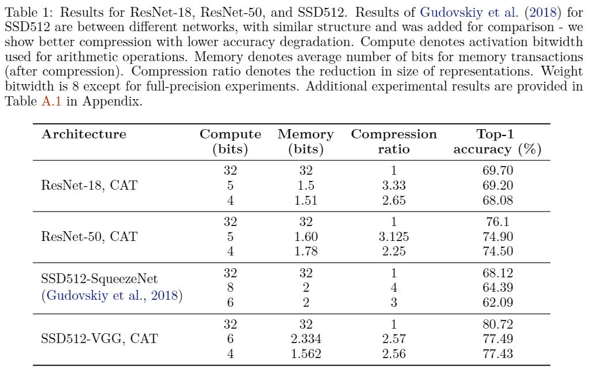
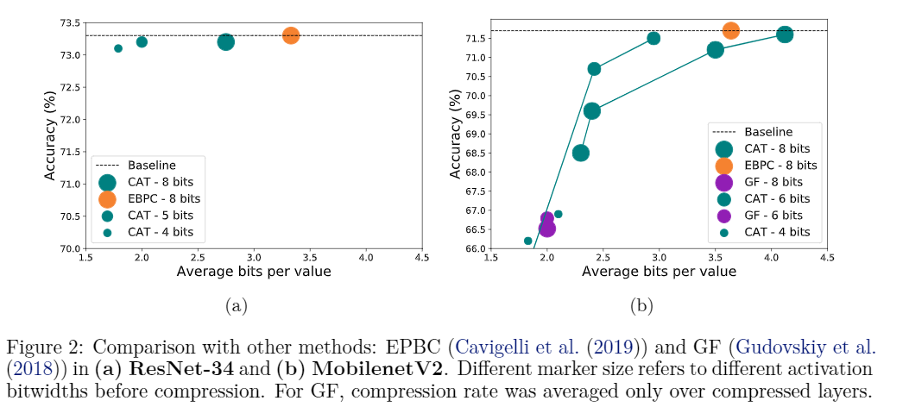
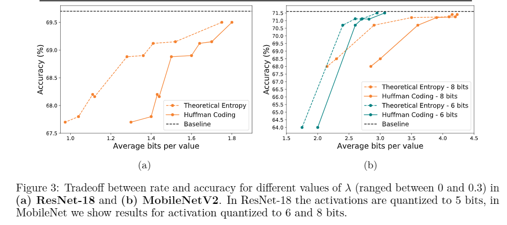

# CAT
Implementation of CAT paper

This code implements the papper "CAT - Compression-Aware Training  for bandwidth reduction"

Arxiv link - TODO

## Datasets  

### Classification

To run this code on classification task you need the training and validation set of ILSVRC2012 data

To get the ILSVRC2012 data, you should register on their [site](http://www.image-net.org/download-imageurls) for access
 
### Detection

To run this code on detection task you need to [download](https://www.kaggle.com/huanghanchina/pascal-voc-2012
) PASCAL VOC dataset

## Running instructions

### Classification

python main.py --data < ILSVRC2012 folder location > --model < Model name (resnet18 / resnet34 / resnet50 / mobilenet_v2) >  --actBitwidth < Bits for main principal component > --weightBitwidth < 8/32 >  --clip --method < compression \ entropy > --regul < Lambda value for activations > --regul2 < Lambda value for weights >

### Detection

VOC_ROOT= <PASCAL VOC folder location > NGPUS=< Number of Gpus > python -m torch.distributed.launch --nproc_per_node=2 SSD/train_entropy.py --config-file SSD/configs/vgg_ssd512_voc0712.yaml --ckpt SSD/vgg_ssd512_voc0712.pth --regul 0.08 MODEL.BACKBONE.PRETRAINED False SOLVER.BATCH_SIZE 2 TEST.BATCH_SIZE 8 SOLVER.MAX_ITER 160000 OUTPUT_DIR SSD/outputs/vgg_ssd512_voc0712_84bit_reg008
  
* For more details: our code is based on https://github.com/lufficc/SSD

## Results
 
 
 
  
 
 
  
## Acknowledgments  
TODO

## Citation  
TODO  
